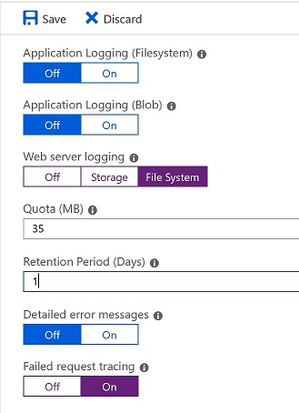
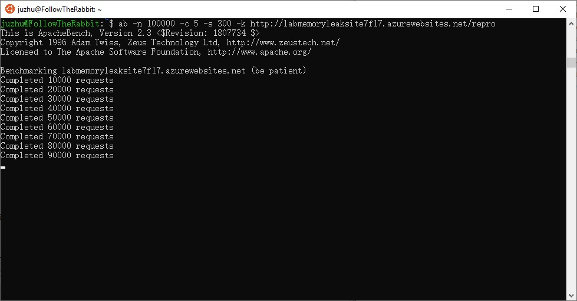

# Test Application Initialization in Azure App Services

We can use Application Initialization to warmup an worker instance in Azure App Service. So that when an App Service Plan is scaled out, the new worker instance is warmed up, before it receives real end user requests.

# Setup
I deployed a .Net framework MVC application with a WarmupController class below:

```c#
public class WarmupController : Controller
{
    // GET: Warmup
    public string Index()
    {
        Thread.Sleep(60000);
        return "Warmed up";
    }
}
```
 
And the web.config file:
```xml
<applicationInitialization>
    <add initializationPage="/warmup/" />
</applicationInitialization>
<tracing>
    <traceFailedRequests>
    <remove path="*" />
    <add path="/warmup/">
        <traceAreas>
        <add provider="ASP" verbosity="Verbose" />
        <add provider="ASPNET" areas="Infrastructure,Module,Page,AppServices" verbosity="Verbose" />
        <add provider="ISAPI Extension" verbosity="Verbose" />
        <add provider="WWW Server" areas="Authentication,Security,Filter,StaticFile,CGI,Compression,Cache,RequestNotifications,Module,Rewrite,iisnode" verbosity="Verbose" />
        </traceAreas>
        <failureDefinitions statusCodes="200-500" />
    </add>
    </traceFailedRequests>
</tracing>
 ```
I turn on the ``Failed Request Trace`` and ``Web Server Log`` for the site.


The log files can be found in the D:\home\LogFiles\ folder of the site, when I log on to the Kudu site.

I use ``ab`` to trigger site requests load:
```
ab -n 1000000 -c 2 http://juzhuwarmup.azurewebsites.net/home/about
```


When the load test is on, I scale out the plan to add a new worker instance.
 
# Test result
The ``ab`` requests are not sent the new instance, until the warmup request is returned.

# Things to note.
* The warmup request is not recorded in the IIS log, we have to enable the above Faild Request Trace Log in web.config, in order to see it. Here is a [sample of the FREB trace](fr000002.xml).
* No warmup during scaling up. See this [feedback](https://feedback.azure.com/forums/169385-web-apps/suggestions/33580975-add-application-initialization-support-for-scale-u)
* There is no retry and wait until the warmup page returns a 200 response.
    In other words, it disregard the response code of the warmup request
    The following code won't block the App Service frontend to forward end user requests to the new worker.
    ```c#
    public string NoSleep()
    {
        TimeSpan differnce = DateTime.Now - startupTimestamp;

        if (differnce < TimeSpan.FromSeconds(80))
        {
            Response.StatusCode = 502;
        }
        return "Warming up";
    }
    ```
* [Code of this test site](https://github.com/4lowtherabbit/LabAppInit) published in GitHub.