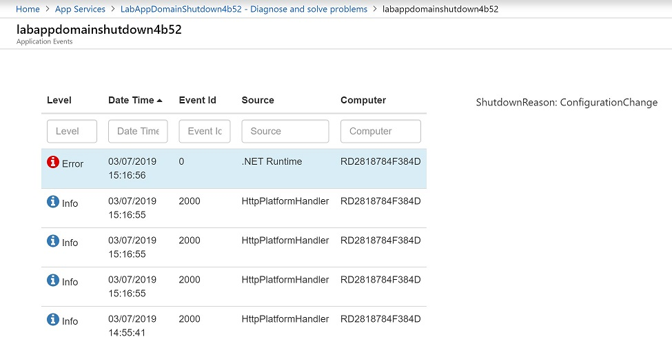

# How to trace for ASP.NET App Domain shutdown for reasons

Scott has written a [blog post](https://weblogs.asp.net/scottgu/433194) on this topic about 14 years ago. It was based on invoking some functions via refectoring.

The latest .NET API allows to get the shutdown reason information more directly via the following code in Global.asax
```C#
        protected void Application_End()
        {
            var reason = HostingEnvironment.ShutdownReason;

            EventLog log = new EventLog();
            log.Source = ".NET Runtime";
            log.WriteEntry($"ShutdownReason: {reason}", EventLogEntryType.Error);
        }
```

## Test
After I append an empty line into web.config and save the file, the ASP.NET application is restarted. I can find the following event in Azure App Service's D:\Home\Logfiles\eventlog.xml file:
```XML
    <Event>
        <System>
            <Provider Name=".NET Runtime"/>
            <EventID>0</EventID>
            <Level>1</Level>
            <Task>0</Task>
            <Keywords>Keywords</Keywords>
            <TimeCreated SystemTime="2019-03-07T14:09:35Z"/>
            <EventRecordID>1361488562</EventRecordID>
            <Channel>Application</Channel>
            <Computer>RD0003FF6547C6</Computer>
            <Security/>
        </System>
        <EventData>
            <Data>ShutdownReason: ConfigurationChange</Data>
        </EventData>
    </Event>
```

Also, I can search ``Application Events`` in the ``Diagnose and solve problems`` blade of the site and see the following event:


## Sample project
I have published a [sample project](https://github.com/4lowtherabbit/LabAppDomainShutdown)