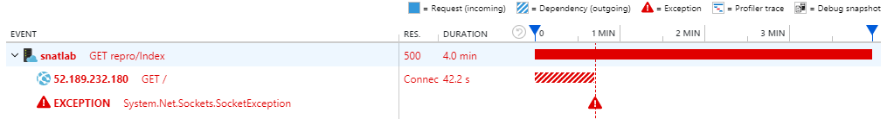

# SNAT with App Service

Usually, an App Service web application needs to connect to a few external endpoints, like SQL database, Redis cache or another Restful web service, etc. However, an App service web application cannot establish network connections to the external Internet endpoints directly.

This is because an App Service web application is hosted by one or some App Service worker instances, which are bounded inside the scale unit (stamp) of the site and only have internal IP addresses of the stamp's subnet. The worker instances don’t have Internet IP addresses. The worker instances need to leverage their stamp's load balancer to do the Source Network Address Translation, aka SNAT, in order to connect to external IP addresses.

## How does SNAT work? 
SNAT is not a new technology. When you connect your phone to a public Internet site through your home WIFI router, your router does the network address translation too.

Let's take TCP protocol for instance, SNAT works in the following steps:
1.	An App Service application sends a TCP package to an Internet IP address. The source IP address and port number of the package is internal.

2.	The TCP package is routed from a worker instance to the SNAT load balancer. SNAT changes the source IP and port of the TCP package into its own ones and sends it out to the Internet.

      It also keeps a record of the following mapping:

      |Protocol|Worker instance IP address:port|Load balancer IP address:port|External endpoint IP address:port|
      |--------|-------------------------------|-----------------------------|---------------------------------|
      |TCP     |10.0.5.60:51014                |13.76.245.72:12481           |52.189.232.180:80                |

3.	The Internet server receives the TCP package. Later when it sends back any package, it uses the IP address and port of the load balancer, as the destination of the package.

4.	When the load balancer receives a package routed back from the Internet server, it changes the destination IP and port to the ones of the worker instance, by using the mapping record above. The package then can be routed back to the worker instance.

The above process is transparent to the worker instance and the Internet server. The load balancer does all the address translation job for them.

## SNAT ports exhaustion
SNAT load balancer is a shared resource between all of App Service sites in the same stamp. Including the web applications, WebJobs, Functions, telemetry services (Application Insights), etc. All services inside a stamp need the load balancer to establish their network flows to external endpoints.

According to [https://docs.microsoft.com/en-us/azure/load-balancer/load-balancer-outbound-connections#tcp](https://docs.microsoft.com/en-us/azure/load-balancer/load-balancer-outbound-connections#tcp)

> TCP SNAT Ports
> * One SNAT port is consumed per flow to a single destination IP address, port. For multiple TCP flows to the same destination IP address, port, and protocol, each TCP flow consumes a single SNAT port. This ensures that the flows are unique when they originate from the same public IP address and go to the same destination IP address, port, and protocol.
> * Multiple flows, each to a different destination IP address, port, and protocol, share a single SNAT port. The destination IP address, port, and protocol make flows unique without the need for additional source ports to distinguish flows in the public IP address space.

Every IP address is limited to open 65536 ports at the most. A typical App Service stamp has 5 outbound IP addresses for its SNAT load balancer. These ports are shared by all instances inside a stamp. A typical App Service stamp has thousands of instances. **The SNAT ports is a limited resource of a stamp**.

Things can get worse if applications open and close connections frequently. According to: [https://docs.microsoft.com/en-us/azure/load-balancer/load-balancer-outbound-connections#tcp-snat-port-release](docs.microsoft.com/en-us/azure/load-balancer/load-balancer-outbound-connections#tcp-snat-port-release)

> TCP SNAT port release
> * If either server/client sends FINACK, SNAT port will be released after 240 seconds.
> * If a RST is seen, SNAT port will be released after 15 seconds.
> * If idle timeout has been reached, port is released.

That means if a web application opens a HTTP connection to call its backend Restful web service once every second and well closes the connection after each call, it will occupy 240 SNAT ports in 240 second.

That also means a busy website whose SQL database connection pool size is 300, will occupy 300 SNAT ports, when its SQL queries execute slowly in the database.

A third example, considering a function app that is triggered by queue messages and saves its results to storage blobs, if at the beginning of a load test, all test messages are dumped into the queue, the function app will exhaust SNAT ports very soon.

## SNAT port allocation algorithms
In order to prevent sites from exhausting SNAT ports of a stamp and blocking other sites in the same stamp to connect to Internet, an algorithm for SNAT port allocation is required.

Actually, there are 2 algorithms available in Azure load balancer for SNAT port allocation:
* On-demand algorithm

  160 ports per instance as base, can be more on-demand. 
* The new algorithm

  128 ports per instance fixed and pre-allocated.

How each algorithm works is described in [https://azure.microsoft.com/en-us/blog/azure-load-balancer-to-become-more-efficient/](https://azure.microsoft.com/en-us/blog/azure-load-balancer-to-become-more-efficient/)

Most App Service stamps are currently using the on-demand algorithm and would potentially migrate to the new algorithm in the future. So, speaking of a total SNAT ports value that a worker instance is guaranteed to have, it should be 128.

The complexity of the on-demand algorithm comes from its on-demand nature. If an App Service worker instance reaches its guaranteed base limit: 160, the load balancer will try its best effort to allocate more ports for the instance, if the load balancer still has adequate ports for allocation. But the next time when the instances asks for the same number of SNAT ports, the request will fail, if the load balancer is tight of the ports.

This could happen in the following 2 scenarios:

* A web application can successfully allocate much more than 160 ports in midnight but can allocate a smaller number of ports during business hours when other sites in the same stamps are spinning too.
* A web application can successfully allocate much more than 160 ports when it was firstly created (usually in a new stamp, which has many idle instances for future sites), but months or years later the stamp gets crowded and the stamp allocates less ports to the web application before it’s exhausted.

Despite the complexity of the algorithms, the strategy is simply: as long as we limit our web application to use no more than 128 connections per instance, the load balancer will not block our web application to connect to external endpoints for SNAT port exhaustion.

## Symptom, when SNAT port exhausted
When an instance’s SNAT ports are exhausted, the following symptoms can be observed from the application:
* Slow and pending on connecting to the remote endpoint.
* Socket exceptions when the connections timeout in the web application

If Application Insight dependency tracking is enabled to the web application, we will see a failure like below:


## How to solve a SNAT exhausting issue for App Service

The general guidance in [https://docs.microsoft.com/en-us/azure/load-balancer/load-balancer-outbound-connections#problemsolving](https://docs.microsoft.com/en-us/azure/load-balancer/load-balancer-outbound-connections#problemsolving) can be applied to App Service web applications, including:
* Modify the application to reuse connections
* Modify the application to use connection pooling
* Modify the application to use less aggressive retry logic
* Use keepalives to reset the outbound idle timeout

Also specific to App Service:
* Ensure the backend services can return response quickly.
* Scale out the App Service plan to more instances
* Use App Service Environment, whose worker instance can have more SNAT ports, due to its smaller instances pool size.
* A load test should simulate real world data in a steady feeding speed.

## FAQs
**Q**: Can I observe the SNAT ports
allocation metric of my App Service site by myself?

**A**: The data is currently not available to public. We should not use this metric to test and decide how many outbound connections a web application can use. The best practice is to keep it below 128.

If you do need it, you can still open a support ticket and the support engineer will get the metric from backend for you.

**Q**: Why cannot I configure auto scale out based on SNAT ports allocation metric?

**A**: We should scale out, only when an application does need more resource. But if an issue is due to the application doesn’t use the resource efficiently, we should improve the code first, otherwise more instances wouldn’t solve the issue.

160 connections to a single endpoint is adequate in most scenarios, for web applications. If an application asks for more, usually it is due to either the backend service has a performance issue, or the application doesn’t reuse the connections. Scaling out to more instances doesn’t solve the issue in these scenarios.

**Q**: How is SNAT related to the TCP connections

**A**: There is a TCP connections usage detector, in the Diagnose and Solve Problems blade of any App Service site. You can search "TCP connections" there to find it.
"TCP Connections" and "SNAT Ports" are not quite related.
1. The SNAT Ports are only used for external network flows, while the total TCP Connections includes local loopback connections.
2. A SNAT port can be share by different flows, if they are different in either protocol, IP address or port. The TCP Connections metric counts on every TCP connection.
3. The TCP Connections limit happens at worker instance’s sandbox level. The load balancer doesn’t use the TCP Connections metric for SNAT port limiting.

**Q** I have mutiple WebJobs hosted by a single site. They run together and share each worker instances of the site's App Service Plan. They also need to connect to the same external endpoint, which is Azure SQL database. Now they have an SNAT port exhaustion issue, since the WebJobs are complaining not able to connect to the database. How do I know which WebJob opens the most database connections and causes the issue?

**A** We don't have a metric to show us how many connections is opened by each process. In order to narrow it down, please move some WebJobs out to another App Service plan to see things get better? Or if the issue remains in one of the plans. You can iterate, until spotting out the culprit.

## Lab
The following code snipper can reproduce the SNAT port exaustion issue:
```C#
public string Index(string url)
{
    var request = HttpWebRequest.Create(url);
    request.GetResponse();

    return "OK";
}
```
In order to reuse the connections, we can change it like below:
```C#
public string Fin(string url)
{
    var request = HttpWebRequest.Create(url);
    var response = request.GetResponse();
    response.Close();

    return "OK";
}
```

This one leaks SNAT ports too:
```C#
public async Task<string> Client(string url)
{
    using (var client = new HttpClient())
    {
        await client.GetAsync(url);
    }

    return "OK";
}
```
Which can be rewritten into the following one, in order to reuse the connections of only one HttpClient:

```C#
private static Lazy<HttpClient> _client = new Lazy<HttpClient>();

public async Task<string> ReuseClient(string url)
{
    var client = _client.Value;
    await client.GetAsync(url);
    return "OK";
}
```

The code is published on GitHub.
* [LabSNAT](https://github.com/4lowtherabbit/LabSNAT)
* [LabDelay](https://github.com/4lowtherabbit/LabDelay)

You can try it yourself by deploying the code to your site and running the following command in a Bash console:
```Bash
ab -r -n 100000 -c 500 -s 120 https://labsnatxxxx.azurewebsites.net/repro/?url=https://labdelayxxxx.azurewebsites.net/delay?seconds=50
```